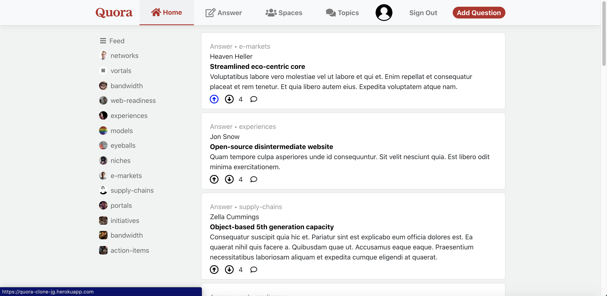

# Quora Clone

This app is an attempt to recreate the question and answer app, Quora, written in Javascript for NodeJS.

To get run this app locally, you'll need a working NodeJS development environment. You'll also need npm for easy JS dependency management.

This app is set to run on port 3000 by default.

## Technologies

### Frontend SPA

- React
- CSS (SCSS)
- Javascript
- react-router-dom

### Backend REST API

- postgresql
- bcrypt
- redis
- sequelize
- express
- cors
- Javascript
- node

## Features Reproduced

### Login Page

- Sign in/up normally

### After Sign up

- Follow Spaces

### Main Page

- News Feed (interested spaces)
- List of spaces and Topics

### Nav Bar

- Spaces Link
- Topics Link (nice to have)
- Profile Icon
- Answer (List of questions)

### Questions

- Tags
- You can answer the question
- See related questions
- See related Spaces
