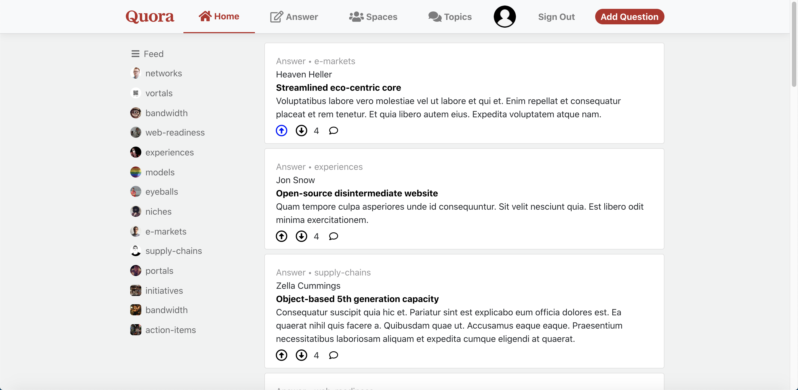

# Quora Clone (js)

This app is an attempt to recreate the question and answer app, Quora, written in Javascript for NodeJS.

## Getting Started

To get run this app locally, you'll need a working NodeJS development environment. You'll also need npm for easy JS dependency management.

First, run "npm install" within both the client and API directories.

Next, run "npm run db:migrate" in the API directory to set up the database. If you would like to use junk data, you could then run "npm run db:seed" within the same directory.

This app is set to run on port 3000 by default.

## Technologies Used

### Frontend SPA

- React
- Javascript
- CSS (SCSS)

### Backend REST API

- postgresql
- sequelize
- node
- express
- redis
- Javascript

## Features Reproduced

### Login Page

- Sign in/up normally

### After Sign up

- Sends to the Spaces page where you must follow at least one space

### Main Page

- News Feed of questions from followed spaces and topics
- List of spaces and Topics

### Nav Bar

- Link to Spaces page
- Link to Topics page
- Profile Icon
- sing out button
- Answer (sends to a page with a list of questions to answer)

### Questions

- have Tags
- You can answer the question
- You can see related questions
- You can see related Spaces
